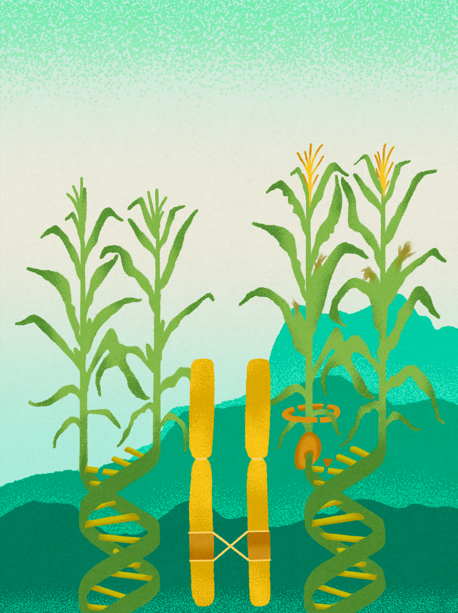

<div align="center">
  
</div>

# inv4m

Analysis pipeline for the maize chromosomal inversion Inv4m: **modulation of flowering time, plant height, and growth regulation gene networks**. Peer review response edits applied (2026-02-24).

**[View Analysis Reports](https://sawers-rellan-labs.github.io/inv4m/)**

## Overview

This repository contains R/Rmarkdown analysis notebooks for studying the Inv4m inversion in maize (*Zea mays*), focusing on:

- Phenotypic effects on flowering time and plant height
- Gene-by-environment interactions across field environments
- Differential gene expression and candidate gene identification (JMJ cluster)
- WGCNA network perturbation analysis
- Phosphorus stress response (companion paper)
- GO/KEGG pathway enrichment

## Phosphorus Paper: Figure/Table Coverage

| Figure/Table | Content | Notebook | Status |
|--------------|---------|----------|--------|
| **Main Figures** | | | |
| Figure 1 | Phenotypes (flowering, biomass, yield) | [`PSU2022_phenotype_marginal_means.Rmd`](https://sawers-rellan-labs.github.io/inv4m/phosphorus_paper/PSU2022_phenotype_marginal_means.html) | ✅ |
| Figure 2 | Ionome (P, Ca, S, Zn) | [`PSU2022_ionome.Rmd`](https://sawers-rellan-labs.github.io/inv4m/phosphorus_paper/PSU2022_ionome.html) | ✅ |
| Figure 3 | Transcriptomics & lipidomics MDS | [`differential_expression_leaf_treatment_model.Rmd`](https://sawers-rellan-labs.github.io/inv4m/phosphorus_paper/differential_expression_leaf_treatment_model.html) + [`Lipid_differential_abundance.Rmd`](https://sawers-rellan-labs.github.io/inv4m/phosphorus_paper/Lipid_differential_abundance.html) | ✅ |
| Figure 4 | GO & KEGG enrichment | [`Annotation_assembly.Rmd`](https://sawers-rellan-labs.github.io/inv4m/phosphorus_paper/Annotation_assembly.html) | ✅ |
| Figure 5 | Senescence & transcription indices | [`PSU2022_make_transcription_indices.Rmd`](https://sawers-rellan-labs.github.io/inv4m/phosphorus_paper/PSU2022_make_transcription_indices.html) | ✅ |
| **Supplementary Figures** | | | |
| Figure S1 | Anthesis & plant height | [`PSU2022_phenotype_marginal_means.Rmd`](https://sawers-rellan-labs.github.io/inv4m/phosphorus_paper/PSU2022_phenotype_marginal_means.html) | ✅ |
| Figure S2 | Growth curves & parameters | [`PSU2022_growthcurves.Rmd`](https://sawers-rellan-labs.github.io/inv4m/phosphorus_paper/PSU2022_growthcurves.html) | ✅ |
| Figure S3 | Secondary ionome (Mg, Mn, K, Fe) | [`PSU2022_ionome.Rmd`](https://sawers-rellan-labs.github.io/inv4m/phosphorus_paper/PSU2022_ionome.html) | ✅ |
| Figure S4 | Euler/Upset DEG plots | [`GO_Enrichment_Analysis_of_DEGs.Rmd`](https://sawers-rellan-labs.github.io/inv4m/phosphorus_paper/GO_Enrichment_Analysis_of_DEGs.html) | ✅ |
| Figure S5 | Manhattan & volcano plots | [`volcano_plot_analysis.Rmd`](https://sawers-rellan-labs.github.io/inv4m/phosphorus_paper/volcano_plot_analysis.html) | ✅ |
| Figure S6 | Lipid class composition | [`Lipid_differential_abundance.Rmd`](https://sawers-rellan-labs.github.io/inv4m/phosphorus_paper/Lipid_differential_abundance.html) | ✅ |
| Figure S7 | MS injection order | [`Lipid_differential_abundance.Rmd`](https://sawers-rellan-labs.github.io/inv4m/phosphorus_paper/Lipid_differential_abundance.html) | ✅ |
| **Supplementary Tables** | | | |
| Table: phosphorusDEGs | Selected DEGs under -P | [`differential_expression_leaf_treatment_model.Rmd`](https://sawers-rellan-labs.github.io/inv4m/phosphorus_paper/differential_expression_leaf_treatment_model.html) | ✅ |
| Table: leafDEGs | Selected DEGs for Leaf effect | [`differential_expression_leaf_treatment_model.Rmd`](https://sawers-rellan-labs.github.io/inv4m/phosphorus_paper/differential_expression_leaf_treatment_model.html) | ✅ |
| Table: leafxpDEGs | Selected DEGs for Leaf×-P | [`differential_expression_leaf_treatment_model.Rmd`](https://sawers-rellan-labs.github.io/inv4m/phosphorus_paper/differential_expression_leaf_treatment_model.html) | ✅ |
| Table: PSRupDEGs | GO:0016036 annotated DEGs | [`GO_Enrichment_Analysis_of_DEGs.Rmd`](https://sawers-rellan-labs.github.io/inv4m/phosphorus_paper/GO_Enrichment_Analysis_of_DEGs.html) | ✅ |
| Table: goleafxP_genes | Leaf×-P GO annotated | [`GO_Enrichment_Analysis_of_DEGs.Rmd`](https://sawers-rellan-labs.github.io/inv4m/phosphorus_paper/GO_Enrichment_Analysis_of_DEGs.html) | ✅ |
| Table: leaf_lipids | Differentially abundant lipids (leaf) | [`Lipid_differential_abundance.Rmd`](https://sawers-rellan-labs.github.io/inv4m/phosphorus_paper/Lipid_differential_abundance.html) | ✅ |
| Table: phosphorus_lipids | Differentially abundant lipids (-P) | [`Lipid_differential_abundance.Rmd`](https://sawers-rellan-labs.github.io/inv4m/phosphorus_paper/Lipid_differential_abundance.html) | ✅ |
| **Supplementary Files** | | | |
| S1 File | Senescence-associated DEGs (110 genes) | [`PSU2022_make_transcription_indices.Rmd`](https://sawers-rellan-labs.github.io/inv4m/phosphorus_paper/PSU2022_make_transcription_indices.html) | ✅ |
| **Infrastructure** | | | |
| Spatial correction | Pre-processing for phenotypes | [`spatial_correction_for_INV4MXP.Rmd`](https://sawers-rellan-labs.github.io/inv4m/phosphorus_paper/spatial_correction_for_INV4MXP.html) | ✅ |
| LION enrichment | Lipid ontology analysis | [`LION_Lipid_Enrichment_Analysis.Rmd`](https://sawers-rellan-labs.github.io/inv4m/phosphorus_paper/LION_Lipid_Enrichment_Analysis.html) | ✅ |
| Annotation assembly | GO/KEGG/LION enrichment panels | [`Annotation_assembly.Rmd`](https://sawers-rellan-labs.github.io/inv4m/phosphorus_paper/Annotation_assembly.html) | ✅ |

## Inversion Paper: Revision Status

### Peer review edits applied (2026-02-24)

18 text edits addressing internal peer review (see `scripts/00_agent_work/peer_review_inversion_paper.md` and `review_response_edits.md`):

| Category | Key changes |
|----------|------------|
| **Attribution** | Soften Inv4m → "Inv4m introgression"; note reduction from Crow 2020 linkage drag (57→24 Mb); reframe OR=1.02 as evidence against position effects |
| **GxE context** | Lead with environment-dependent framing; qualify PSU2022 effects as site-specific; reframe internode data within GxE reversal |
| **JMJ cluster** | Lead Discussion with CNV (5:1 copy number) as baseline; foreground field-specific regulatory suppression (49-61% of expected) as novel finding; clarify single-copy state is ancestral |
| **Mechanistic claims** | "Mechanistic chain" → "working model"; soften SAM-to-field causal language; note ChIP-seq/H3K4me3 needed |
| **WGCNA** | Add caveat about DEG input set; cite magenta (non-significant) as counterexample |
| **Trans-network** | "Novel" → "Dataset-specific" throughout; explain low MaizeNetome overlap as tissue/context difference |
| **Local adaptation** | "Characteristic of" → "consistent with"; add reciprocal transplant caveat |
| **Limitations** | Expand to 4 structured points: flanking drag, B73 background, sample size, SAM/RNA-seq stage gap |
| **Minor** | Fix units nm⁻¹ → μm⁻¹; clarify CML457/CML459 as CIMMYT tropical lines |

## Inversion Paper: Figure/Table Coverage

| Figure/Table | Content | Notebook | Status |
|--------------|---------|----------|--------|
| **Main Figures** | | | |
| Figure 1 | Inv4m delimitation, breakpoints, breeding design | [`plot_genotype_get_correlated_loci.Rmd`](https://sawers-rellan-labs.github.io/inv4m/inversion_paper/plot_genotype_get_correlated_loci.html) | ✅ |
| Figure 2 | Effect of Inv4m on PH, DTA, DTS, HI | [`Corrected_phenotype_analysis_PSU2022.Rmd`](https://sawers-rellan-labs.github.io/inv4m/inversion_paper/Corrected_phenotype_analysis_PSU2022.html) | ✅ |
| Figure 3 | Global and local transcriptomic effects (8 panels) | [`assemble_figure3_RNAseq.Rmd`](https://sawers-rellan-labs.github.io/inv4m/inversion_paper/assemble_figure3_RNAseq.html) + panel scripts | ✅ |
| Figure 4 | Volcano plots for DEGs | [`volcano_plot_analysis.Rmd`](https://sawers-rellan-labs.github.io/inv4m/inversion_paper/volcano_plot_analysis.html) | ✅ |
| Figure 5 | Trans coexpression network of Inv4m DEGs | [`Analyze_MaizeNetome_TransRegulation.Rmd`](https://sawers-rellan-labs.github.io/inv4m/inversion_paper/Analyze_MaizeNetome_TransRegulation.html) | ✅ |
| Figure 6 | WGCNA module perturbation | [`assemble_WGCNA_figure.Rmd`](https://sawers-rellan-labs.github.io/inv4m/inversion_paper/assemble_WGCNA_figure.html) + field_perturbation | ✅ |
| Figure 7 | JMJ cluster expression + 5-genome microsynteny | [`make_jmj_expression_boxplot.Rmd`](https://sawers-rellan-labs.github.io/inv4m/inversion_paper/make_jmj_expression_boxplot.html) + [`replot_microsynteny_5genomes.sh`](scripts/02_genomics_foundation/replot_microsynteny_5genomes.sh) | ✅ |
| Figure 8 | B73 phenotypic/gene expression model | Manual/Illustrator | N/A |
| **Supplementary Figures** | | | |
| Figure S1 | SNP distribution and correlation | [`plot_genotype_get_correlated_loci.Rmd`](https://sawers-rellan-labs.github.io/inv4m/inversion_paper/plot_genotype_get_correlated_loci.html) | ✅ |
| Figure S2 | GxE interaction plots (MI21 donor) | [`inv4mGxE_3_env.Rmd`](https://sawers-rellan-labs.github.io/inv4m/inversion_paper/inv4mGxE_3_env.html) | ✅ |
| Figure S3 | GxE effect sizes forest plot | [`inv4mGxE_3_env.Rmd`](https://sawers-rellan-labs.github.io/inv4m/inversion_paper/inv4mGxE_3_env.html) | ✅ |
| Figure S4 | Internode analysis (4 panels: height, photos, schematic, profiles) | [`internode_analysis.Rmd`](https://sawers-rellan-labs.github.io/inv4m/inversion_paper/internode_analysis.html) + photos | ✅ |
| Figure S5 | WGCNA module bootstrap support | `field_perturbation/05_bootstrap_support.Rmd` | ✅ |
| Figure S6 | WGCNA module GO enrichment | `field_perturbation/07_module_annotation.Rmd` | ✅ |
| **Main Tables** | | | |
| Table 1 | Inv4m breakpoints | [`plot_genotype_get_correlated_loci.Rmd`](https://sawers-rellan-labs.github.io/inv4m/inversion_paper/plot_genotype_get_correlated_loci.html) | ✅ |
| Table 2 | FT/PH gene candidates | [`phenotype_association_filter.Rmd`](https://sawers-rellan-labs.github.io/inv4m/inversion_paper/phenotype_association_filter.html) | ✅ |
| **Supplementary Tables** | | | |
| Table S1 | Inv4m breakpoints and knob repeats | [`plot_genotype_get_correlated_loci.Rmd`](https://sawers-rellan-labs.github.io/inv4m/inversion_paper/plot_genotype_get_correlated_loci.html) | ✅ |
| Table S2 | Effect of conditions on gene expression | [`differential_expression_leaf_treatment_model.Rmd`](https://sawers-rellan-labs.github.io/inv4m/inversion_paper/differential_expression_leaf_treatment_model.html) | ✅ |
| Table S3 | GxE interaction statistics (3 environments) | [`inv4mGxE_3_env.Rmd`](https://sawers-rellan-labs.github.io/inv4m/inversion_paper/inv4mGxE_3_env.html) | ✅ |
| Table S4 | Module preservation statistics | `field_perturbation/06_preservation.Rmd` | ✅ |
| Table S5 | Greenyellow module DEGs (sec6/pcna2 growth network) | [`greenyellow_module_characterization.Rmd`](https://sawers-rellan-labs.github.io/inv4m/inversion_paper/greenyellow_module_characterization.html) | ✅ |
| Table S6 | Pink module DEGs (jmj2/jmj4 co-expression) | [`jmj_pink_module_characterization.Rmd`](https://sawers-rellan-labs.github.io/inv4m/inversion_paper/jmj_pink_module_characterization.html) | ✅ |
| **Supporting Scripts** | | | |
| Field perturbation pipeline | WGCNA consensus + preservation | `scripts/inversion_paper/field_perturbation/` (7 scripts) | ✅ |
| WGCNA figure assembly | Figure 6 composition | [`assemble_WGCNA_figure.Rmd`](https://sawers-rellan-labs.github.io/inv4m/inversion_paper/assemble_WGCNA_figure.html) | ✅ |
| GO enrichment (network) | Network GO analysis | [`GO_Enrichment_Trans_Network.Rmd`](https://sawers-rellan-labs.github.io/inv4m/inversion_paper/GO_Enrichment_Trans_Network.html) | ✅ |
| Crow 2020 reanalysis | Reference dataset reanalysis | [`Crow2020_reanalysis.Rmd`](https://sawers-rellan-labs.github.io/inv4m/inversion_paper/Crow2020_reanalysis.html) | ✅ |
| 5-genome microsynteny | JMJ cluster panel B (jcvi pipeline) | `scripts/02_genomics_foundation/replot_microsynteny_5genomes.sh` | ✅ |
| Manhattan plots | Fig 3 panels D, E, G, H | [`make_manhattan_plots.Rmd`](https://sawers-rellan-labs.github.io/inv4m/inversion_paper/make_manhattan_plots.html) | ✅ |
| Volcano plot | Fig 3 panel C / Fig 4 | [`volcano_plot_analysis.Rmd`](https://sawers-rellan-labs.github.io/inv4m/inversion_paper/volcano_plot_analysis.html) | ✅ |
| SAM morphology | DIC microscopy analysis | [`SAM_morphology_analysis.Rmd`](https://sawers-rellan-labs.github.io/inv4m/inversion_paper/SAM_morphology_analysis.html) | ✅ |
| Greenyellow module | Greenyellow module characterization (sec6/pcna2) | [`greenyellow_module_characterization.Rmd`](https://sawers-rellan-labs.github.io/inv4m/inversion_paper/greenyellow_module_characterization.html) | ✅ |
| JMJ pink module | Pink module characterization (jmj2/jmj4 growth network) | [`jmj_pink_module_characterization.Rmd`](https://sawers-rellan-labs.github.io/inv4m/inversion_paper/jmj_pink_module_characterization.html) | ✅ |
| Phenotype association filter | FT/PH candidate gene overlap with DEGs | [`phenotype_association_filter.Rmd`](https://sawers-rellan-labs.github.io/inv4m/inversion_paper/phenotype_association_filter.html) | ✅ |

**Status Legend:** ✅ Ready | 🔶 In Progress | ⚠️ Needs work | ❌ Missing

---

## Gene Label Consolidation Method

Short-hand gene labels (e.g., `jmj4`, `pip1d`, `acsn1`) were consolidated for figure annotation using a hierarchical approach:

### Label Sources (Priority Order)

1. **Curated labels** (28 genes) - Manual curation from phosphorus paper (`selected_DEGs_curated_locus_label_2.csv`)
2. **MaizeGDB symbols** (94 genes) - Official locus symbols from `gene_symbol.tab`, filtered to exclude uninformative markers
3. **LLM-proposed labels** (269 genes) - Generated from PANNZER functional descriptions using consistent naming conventions

### Marker Pattern Filtering

MaizeGDB symbols include genetic markers that are uninformative for figure labels. These were identified by analyzing the consensus map (`data/maizegdb_consensus_map/`) and filtered using regex:

```r
MARKER_PATTERN <- paste0(
  "^(umc|pco|bnlg|pza|gpm|csu|php|IDP|TIDP)[0-9]+",  # SSR/SNP markers
  "|^cl[0-9]+_",                                       # Clone markers
  "|^si[0-9]{5,}",                                     # Sequence identifiers
  "|^LOC[0-9]+",                                       # NCBI locus tags
  "|^AY[0-9]+",                                        # GenBank accessions
  "|^Zm00001[de]?b?[0-9]+",                            # Assembly gene IDs
  "|^GRMZM"                                            # B73 RefGen_v3 IDs
)
```

Key insight: Markers have `locus_symbol` but NO `locus_name`; real genes have both.

### LLM-Proposed Label Conventions

For genes with PANNZER descriptions but no symbol, short labels (≤7 characters) were generated following these conventions:

| Category | Convention | Example |
|----------|------------|---------|
| Domain-based | Domain abbreviation + number | `ppr3` (PPR domain), `ring1` (RING finger) |
| Function-based | Function abbreviation | `tars` (threonyl-tRNA synthetase) |
| Protein family | Family name lowercase | `dnaj1` (DnaJ chaperone) |
| Existing nomenclature | Match Arabidopsis/rice orthologs | `abh1`, `gata12` |

### Final Coverage

| Source | Count | % |
|--------|-------|---|
| curated | 28 | 6% |
| symbol | 94 | 20% |
| llm_proposed | 269 | 58% |
| **Total labeled** | **391** | **84%** |
| Unlabeled (no annotation) | 74 | 16% |

Hub gene coverage: 55/65 (85%)

### Scripts

- `scripts/utils/consolidate_locus_labels.R` - Main consolidation workflow
- `scripts/utils/merge_proposed_labels.R` - Merge LLM-proposed labels into master

### Data Files

- `data/locus_labels_master.csv` - Master label file (391 genes)
- `data/locus_labels_proposed_top50.csv` - First 50 LLM-proposed with rationale
- `data/locus_labels_proposed_remaining.csv` - Remaining 219 LLM-proposed

---

## Quick Start

```bash
# Render a single notebook
Rscript scripts/utils/render_notebook.R scripts/phosphorus_paper/GO_Enrichment_Analysis_of_DEGs.Rmd

# Output appears in docs/phosphorus_paper/
```

## Repository Structure

```
inv4m/
├── scripts/
│   ├── phosphorus_paper/    # Paper 2 analysis notebooks (12 Rmd files) ✅
│   ├── inversion_paper/     # Paper 1 analysis notebooks (12 Rmd files) ✅
│   └── utils/               # Shared utilities (setup_paths.R, render_notebook.R)
├── data/                    # Input data (symlink, not tracked)
├── docs/                    # Published HTML reports (GitHub Pages)
│   ├── phosphorus_paper/    # Paper 2 reports (12 HTML files)
│   └── inversion_paper/     # Paper 1 reports
└── results/                 # Generated outputs (not tracked)
    ├── phosphorus_paper/
    └── inversion_paper/
```

## Requirements

- R >= 4.0
- Key packages: `tidyverse`, `here`, `limma`, `edgeR`, `clusterProfiler`, `ggplot2`

## Data

Input data files should be placed in `data/` (symlinked to shared data directory). The pipeline reads from this flat directory structure and writes outputs to organized subdirectories in `results/`.

## License

[Add license information]

## Citation

[Add citation when published]
